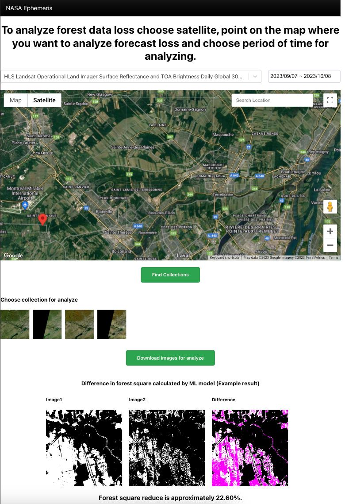

# Green Eye UI: Forest Monitoring Dashboard

Welcome to the **Green Eye UI** project — the visual gateway to real-time global forest monitoring.

As the world becomes increasingly digital, the need for intuitive, interactive, and user-friendly platforms to visualize complex data is paramount. Our forests, often referred to as the lungs of our planet, are undergoing rapid changes. Tracking these changes is no longer a luxury but a necessity. The **Green Eye UI** serves as that interactive lens, presenting a global view of forest dynamics right at your fingertips.

## Features:

- **Interactive Maps**: Dive deep into regions, view forest alterations, and observe patterns with high-resolution imagery.
- **Real-time Data Visualization**: Harness the power of up-to-the-minute data, seamlessly fetched and displayed.

- **Predictive Analysis Interface**: Get insights into potential future forest shifts based on historical data and sophisticated predictive models.

- **User Customization**: Tailor your experience. Set alerts, mark areas of interest, and interact with the platform in a way that serves your unique needs.

- **Integration with Main AI Model**: Directly linked with our state-of-the-art AI model, ensuring accurate, fast, and actionable insights.

Be it policymakers, environmentalists, or curious individuals, the **Green Eye UI** is crafted for all, ensuring that the story of our forests is not just told, but experienced. Dive in, explore, and let's together champion the cause of our planet's green cover.

## Available Scripts

In the project directory, you can run:

### `npm start`

Runs the app in the development mode.\
Open [http://localhost:3000](http://localhost:3000) to view it in the browser.

The page will reload if you make edits.\
You will also see any lint errors in the console.

### `npm test`

Launches the test runner in the interactive watch mode.\
See the section about [running tests](https://facebook.github.io/create-react-app/docs/running-tests) for more information.

### `npm run build`

Builds the app for production to the `build` folder.\
It correctly bundles React in production mode and optimizes the build for the best performance.

The build is minified and the filenames include the hashes.\
Your app is ready to be deployed!

See the section about [deployment](https://facebook.github.io/create-react-app/docs/deployment) for more information.

### `npm run eject`

**Note: this is a one-way operation. Once you `eject`, you can’t go back!**

If you aren’t satisfied with the build tool and configuration choices, you can `eject` at any time. This command will remove the single build dependency from your project.

Instead, it will copy all the configuration files and the transitive dependencies (webpack, Babel, ESLint, etc) right into your project so you have full control over them. All of the commands except `eject` will still work, but they will point to the copied scripts so you can tweak them. At this point you’re on your own.

You don’t have to ever use `eject`. The curated feature set is suitable for small and middle deployments, and you shouldn’t feel obligated to use this feature. However we understand that this tool wouldn’t be useful if you couldn’t customize it when you are ready for it.

## Learn More

You can learn more in the [Create React App documentation](https://facebook.github.io/create-react-app/docs/getting-started).

To learn React, check out the [React documentation](https://reactjs.org/).
